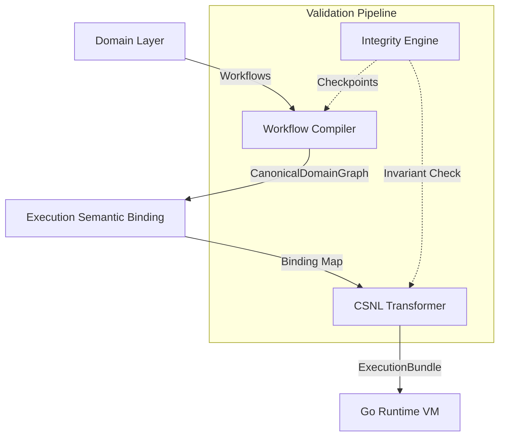

# Zensorum System Overview

The Zensorum platform is a deterministic, cross-runtime healthcare execution and verification architecture. It separates semantic domain intent from deterministic runtime execution through a multi-stage compilation pipeline.

## Architectural Pipeline

## System Layers
1. **Domain Layer:** Semantic business logic and workflow orchestration.
2. **Workflow Compiler:** Compiles abstract workflows into `CanonicalDomainGraph`.
3. **Binding:** Binds graph semantics to deterministic execution primitives.
4. **CSNL:** Normalizes and finalizes the `ExecutionBundle` for the runtime.
5. **Runtime VM:** The deterministic `ExecutionMachineInterpreter` executing the bundle.
