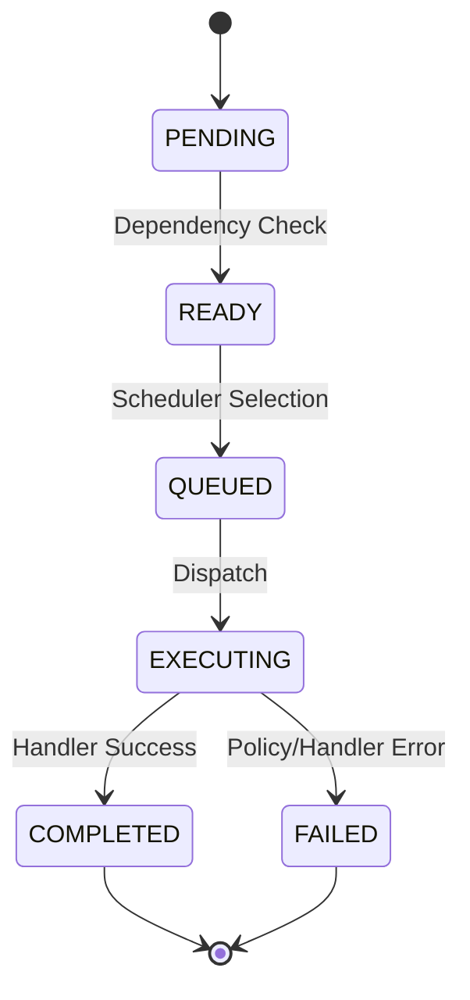

# Execution Machine Interpreter

The Go runtime is formalized as the `ExecutionMachineInterpreter`.

## Machine Model
The runtime interprets an `ExecutionBundle`, which acts as a serialized `ExecutionMachineModel`.

## Determinism Guarantees
1. **Tick-Based Execution:** The runtime executes in discrete ticks. All state transitions within a tick are buffered and committed atomically.
2. **Snapshot Isolation:** The scheduler operates on a static, read-only `ExecutionSnapshotState` per tick.
3. **No Hidden Flow:** All control flow (including AI fallback paths) is pre-resolved in the `ExecutionBundle`. The runtime has no branching logic of its own.
